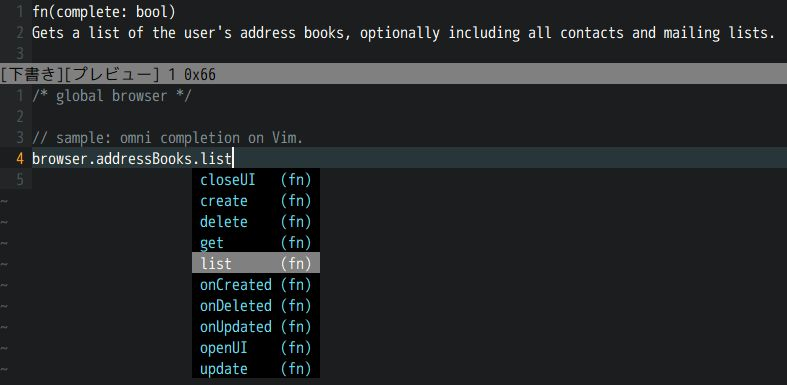

# tern-def-tbext


At ver 0.1.0, `webextensions-desktop-nightly.json` is included.
since ver **1.0.0**,  that file is droped, because it is irrelevant.

 * Thunderbird extension definition files for [tern](http://ternjs.net/).
   * for completion
 * [Thunderbird WebExtension APIs](https://thunderbird-webextensions.readthedocs.io/en/latest/)
 * all things are rough.
 * this does not include any URL of online doc for Thunderbird extension (MDN does not support.
   [comment](https://github.com/mdn/browser-compat-data/pull/2333#issuecomment-435333658))
 * [npm package](https://www.npmjs.com/package/tern-def-tbext) provides definition-file.
   * distilled from comm-central and mozilla-central repositories.


## how to use with tern

I confirmed only with vim. install [tern-for-vim](https://github.com/ternjs/tern_for_vim) 
and add to project's `.tern-project` file.
This package include a definition-file.

```.tern-project
{
  "libs": [
    "browser",
    "node_modules/tern-def-tbext/defs/tbext-nightly"
  ]
}
```


## make definition files

```console
$ npm run build -- --mozilla-repo /path/to/mozilla --comm-repo /path/to/comm
```

This create only `tbext-nightly.json` definition-file.

*Notice*
Since ver. 1.1.1, ``--mozilla-repo`` is necessary to include Firefox APIs.

(At 2019-04-11) You will see following error messages, but no problem.

```console
> tern-def-tbext@1.5.0 build X:\path\to\tern-def-tbext
> node build.js "--mozilla-repo" "x:/repository/mozilla-central" "--comm-repo" "x:/repository/mozilla-central/comm"
"--shrink"

(API: commAPI, Schema Name: commands): Error: ENOENT: no such file or directory, open 'x:\repository\mozilla-central\comm\mail\components\extensions\schemas\commands.json'
(API: commAPI, Schema Name: geckoProfiler): Error: ENOENT: no such file or directory, open 'x:\repository\mozilla-central\comm\toolkit\components\extensions\schemas\geckoProfiler.json'
WARN:split over some files menus
  Problem:dup at menus !doc
(API: commAPI, Schema Name: pkcs11): Error: ENOENT: no such file or directory, open 'x:\repository\mozilla-central\comm\mail\components\extensions\schemas\pkcs11.json'
```


### use not nightly

In case of that you would like to use **beta**.

```console
$ npm run build -- --mozilla-repo /path/to/mozilla-beta --comm-repo /path/to/comm-beta --channel beta
```

This create `tbext-beta.json`. 
`--channel` option only effects to filename. 
Using this option is for switching files specified within `.tern-project`. 
If you don't need to switch, there is no need for this option.


# License
MPL-2.0.

npm package includes json files. These contains contents which come from 
json schema files of comm-central repository. 
Some ones are under 3-Clause BSD License, others are under MPL-2.0 License. 
Both are in `License` directory.

# Release Notes

* 0.1.0 initial release.
* 1.0.0 `webextensions-desktop-nightly.json` is droped.
* 1.1.0 `browser.compose`
* 1.1.1 fix: add Firefox APIs.

  * contentScripts
  * experiments
  * extension
  * i18n
  * management
  * permissions
  * pkcs11
  * runtime
  * theme

* 1.2.0 geckoProfiler
* 1.3.0 fix: pick up `getTargetElement()` of menus API.
  fix: the place of `commands` API files changed.
* 1.4.0 new functions

  * `browser.accounts.createSubfolder()`
  * `browser.accounts.renameFolder()`
  * `browser.accounts.deleteFolder()`

* 1.5.0 new function

  * `browser.contacts.quickSearch()`

* 1.6.0 new function

  * `browser.messages.archive()`

* 1.7.0 new API `folders` and permission `accountsFolders`

  * `MailFolder` move from `accounts` to `folders`
  * `browser.accounts.createSubolder` etc. move to `browser.folders`

* 1.8.0 new arg `id` of `contacts.create()`
* 1.9.0 new property `mailTabs.QuickFilterTextDetail`
* 1.10.0 New: `query()` function of `messages` API
  [1531317](https://bugzilla.mozilla.org/show_bug.cgi?id=1531317)
* 1.11.0 New: `getProfileAsGzippedArrayBuffer()` function of `geckoProfiler` API
  [1551992](https://bugzilla.mozilla.org/show_bug.cgi?id=1551992)
* 1.12.0 New: `dumpProfileToFile()` of `geckoProfiler` API
  [1552845](https://bugzilla.mozilla.org/show_bug.cgi?id=1552845)
* 1.13.0 New: `messageDisplay` API
  [1575708](https://bugzilla.mozilla.org/show_bug.cgi?id=1575708)
* 1.14.0 New: `messageDisplayAction` API
  [1531597](https://bugzilla.mozilla.org/show_bug.cgi?id=1531597)
* 1.15.0

  * Removal: `settingsUrl` of `CloudFile` API
    [1581496](https://bugzilla.mozilla.org/show_bug.cgi?id=1581496)
  * Removal: `sender`  from `mailTabs` API
    [1581498](https://bugzilla.mozilla.org/show_bug.cgi?id=1581498)


[//]: # (vim:expandtab ff=unix fenc=utf-8 sw=2)
